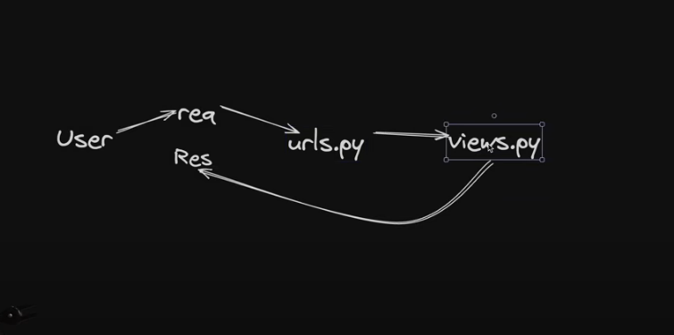

# Python-Django
<h3></h3>
<h2>activate virual environment:</h2>
<h3>with command => ".venv/Scripts/activate"</h3>

<h2>Deactivte environment</h2>
<h3>deactivate</h3>

<h2>Django installation</h2>
<h3>uv pip install Django</h3>

<h2>project start</h2>
<!-- A project will be created only once but apps will be multiple inside the project -->
<h3>django-admin startproject "foldername or projectname"</h3>

a subfolder with the same project or foldername will be created change directory into that folder
and start creating projects

after moving into subfolder use command
<h3>python "filename" runserver (port-name:optional(8001,8000...))</h3>

<h2>Create application:</h2>
<!-- this below command will only create a file inside of project folder(whcih was initailized at start) -->
<!-- urls locator or url.py and settings.py won't be in these applications -->
<h3>python manage.py startapp "app-name"</h3>

<!--1.  first step after creating an app -->
<!-- make the main project aware that a new app has been created through settings.py in main project folder -->
<!-- For this go to settings.py inside of main project folder and write the name of app that is created such as "project1" in this case under installed apps lists -->

<!--2. Second step is to make the templates appear in the application create  -->
<!-- things to consider: we had already made a template under the main project but considering each application is a unique app we can meke a different template in each of the app -->
<!--create a template folder under application and under that same app name and under that all templates will be created  -->

<!-- step 3. as seen in the diagram: make the views(html file inside of project1 render by using request and render) -->
<!-- now the urls has to be passed to the application form main project one  -->
<!-- for this create urls.py within the application as it won't exist -->